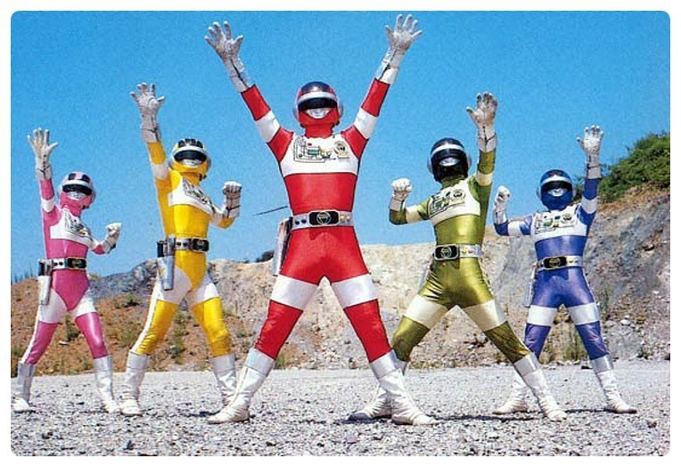

# LAZY-CART
>LazyCart (레이지카트)는 <b>소비자중심</b>의 "YongHunDotCom-licensed 오픈소스 웹-서비스"입니다.  레이지카트는 전적으로 감사하는 후원자님들과 테크니컬-파트너분들의 지속적인 참여를 통해 운영되는 서비스입니다.
  
저희 LazyCart와 함께하고 싶으시다면: 
<ul>
	<li>[후원을 통한 참여](https://www.patreon.com/evanyou).</li>
	<li>[기술적 참여](https://www.patreon.com/evanyou).</li>
</ul>
## Table of contents
* [서비스 설명](#서비스-설명)
* [시연](#시연)
* [컨셉트](#컨셉트)
* [요구사항분석](#요구사항분석)
* [데이터베이스](#데이터베이스)
* [프로젝트 구조와 패턴](#서비스-구조와-패턴)
* [인터페이스와 기능](#인터페이스와-기능)
* [팀워크플로우](#팀워크)
* [팀소개](#팀소개)
## 서비스 설명
* [서비스 정의]
* [팀소개]
* [서비스 목적]
* [Dependencies] (자바 버전, 탐캣버전, 외부 라이브러리등)
| 라이브러리 | 경로 | 버전| 용도|
|---------|--------|-------|-------------|
| Jsoup  | .jar | 1.13.1 | ??????? |
| JSTL  | .jar | ???? | ??????? |
| Standard  | .jar | ???? | ??????? |
| Commons-io  | .jar | 2.7 | ??????? |
| Commons-Fileload  | .jar | 1.4 | ??????? |
| Jquery  | CDN | 3.5.1 / 1.12.4 / 1.12.1 | ??????? |
| (구글) analytics.js  | CDN | 1.2.1 | ???? |
| Chart.js  | CDN | 2.7.1 / 2.9.3 | ???? |
| Util.js  | CDN | ? | ???? |
| (다음) postcode.v2.js  | CDN | ? | ???? |
| popper.js  | CDN | 1.16.0 | ???? |
| Bootstrap  | CDN | 4.5.0 | ???? |
## 주제 및 컨셉
- 주제 소개 : 여러 쇼핑몰에서 살펴본 상품들의 정보를 하나의 장바구니에 담아 상품을 조회, 비교, 구매할 수 있는 프로그램입니다. 기존에는 장바구니 기능은 개별 홈페이지의 상품만 담을 수 있는 반면, LazyCart는 쇼핑몰 페이지 도메인과 무관하게 상품을 담을 수 있어 유저가 보다 편리하게 온라인 쇼핑할 수 있습니다.
- 컨셉 : EasyBasket은 "편리한 온라인 쇼핑을 돕는 장바구니 프로그램"이라는 취지로
	1) 기능적인 측면에서 Chrome Extension을 사용하여 현재 상품 페이지 탭에서 탭 이동 없이 장바구니를 사용할 수 있습니다.
	2) 화면 구성 또한 단순한 구성과 색상으로 Assistance Program으로써 기능적인 면에 보다 충실하고자 합니다.
	
## 유저 중심의 기능 분석
: 익스텐션과 웹은 서로 연동되어 있으면서도 각각에 맞는 기능과 UI를 구상했습니다.
익스텐션은 장바구니 담기와 상품 조회 목적에 최소화하며 화면 또한 단순화 하여 쇼핑에 집중할 수 있도록 합니다.
웹은 필터링/검색/Analysis 등 추가적 기능을 포함하며 특히, 장바구니 상품을 가격, 쇼핑몰, 카테고리 등 기준으로 비교할 수 있습니다.
	1. 각자 그린 프로토 타입
	2. 기능 정리
	
## 서비스 구조와 패턴
	1. 구조 (폴더 구조보여주기)
	<!-- image 삽입 -->
	2. 패턴 (다이어그램)
	<!-- image 삽입 -->
	
## 데이터베이스
데이터베이스+DAO설명?
## 주요 기능 소개
<!-- 전체 기능 분류한 장표 이미지로 삽입 -->
	정렬/필터 기능 - 알고리즘
	<!-- image 삽입 -->
	Analysis - Chart.JS 라이브러리
	<!-- image 삽입 -->
	Extension - iframe, 현재 탭 url 긁어오는 기능 등
	<!-- image 삽입 -->
	Crawling - Jsoup라이브러리, url Parsing
	
	
## 협업방식
1.1. 업무 일지,
  - 팀원끼리 번갈아가며 업무일지 회의록 작성함으로써 팀원 모두 업무 현황을 공유.
  - 매일 회의에서 팀 및 개인적 차원에서 오늘/내일 할 일들을 정리.
1.2. 간트차트
간트차트로 업무 진척도 파악
<!-- image 삽입 -->
1.3. Slack
  - 메신저
  - 깃헙 연동 알람 (Repository Subscription)
2. Version Control System (Github)
  2. 각자 편한 Github 프로그램 사용
1.1. master pull >  work > new branch > pull request
1.2. master pull > work > updated master pull & merge > test > push master
## 팀소개

